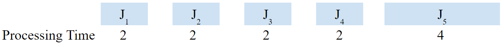

# Load Balancing Problem Approximation Algorithm
Approximation Algorithm for the NP-Complete problem of balancing job loads on machines. (Could be applied to processes management on a CPU). Does not guarantee an optimal solution, but instead, a solution is within a factor of 1.5 of the optimal solution.

## Problem Statement
- `M` identical machines
- `N` jobs
- Each jobs has processing time **Tj**
- `J(i)` is the subset of jobs assigned to machine `i`
- The load of machine `i` is **Li** = sum of the processing times for the jobs on that machine

**Makespan** = the maximum of the loads on the machines (the machine with the largest load)  
**Goal: Minimize the Makespan**

## Solution
Assign each job to a machine to minimize makespan  
There are mn different assignments of n jobs to m machines, which is **exponential**

**The greedy solution runs in polynomial time and gives a solution no more than 1.5 times the optimal makespan**  
Proof involves complicated sigma notation and can be found in the references

**Sort jobs by largest processing time 1st & keep assigning jobs to the machine with the smallest load**  

## Runtime
- O(n log n) for sorting jobs by processing time  
- O(n log m) for Greedy Balance & assigning jobs to machines  
- O(n log n) + O(n log m)  
- **⇒ O(n log n)**

## Input Jobs
### Jobs1 Inputs

### Jobs1 Machine Assignments

 

### Jobs2 Inputs

### Jobs2 Machine Assignments

 

### Jobs3 Inputs

### Jobs3 Machine Assignments

## Usage
**Machine ID's are meaningless since machines are identical, they're created for readability.  
But the algorithm still creates the job assignments on the machines according to the greedy strategy**  
- `int machineCount` parameter is how many machines there are
- `int[][] jobs` is a 2D array containing the jobs
  - `jobs[i]` is an array represents a job
  - `jobs[i][0]` is the **Job Id or name**
  - `jobs[i][1]` is the **Processing time**

## Code Details
- Unlike the pseudocode, the jobs assigned to a machine are inside the `Machine` object in the Priority Queue
- 1st Creates `M` machines with unique Id's
- Then loop over the jobs and assigns the job with the longest processing time to the machine with the smallest current load
  - Java's Priority Queue doesn't really have an `IncreaseKey()` method so the same effect is achieved by removing the machine from the Queue, updating the Machine's `currentLoad` and then adding the Machine back to the Queue
- `Machine` class represents a machine
  - **Some Important Parts of a Machine**
  - `id` is the **ID or name of the machine**
  - `currentLoad` is the sum of the processing times of the jobs currently assigned to the machine
  - `jobs` is a 2D ArrayList containing the jobs currently assigned to the machine
  - `Machine` class **overrides** `compareTo()` from the `Comparable` interface so that the `PriotityQueue is always has the smallest load machine at the top

## References
- [Load Balancing - Approximation Algorithms - Kevin Wayne](http://www.serc.iisc.ernet.in/~simmhan/SE252-JAN2014/lectures/SE252.Jan2014.Lecture-17.pdf)
- [Load Balancing - Arash Rafiey](https://www.sfu.ca/~arashr/lecture24.pdf)
- [Load Balancing - Hantao Zhang](http://homepage.divms.uiowa.edu/~hzhang/c231/ch11.pdf)
- [Load Balancing - Yogesh Simmhan](https://www.cs.princeton.edu/~wayne/kleinberg-tardos/pdf/11ApproximationAlgorithms.pdf)
